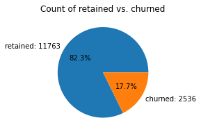
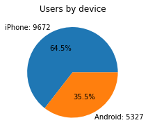
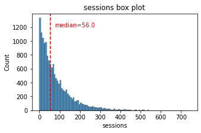
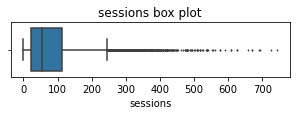
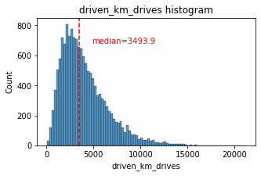
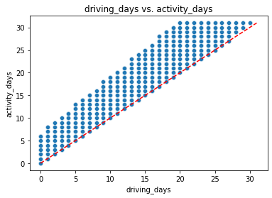
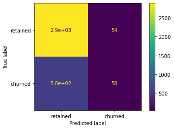
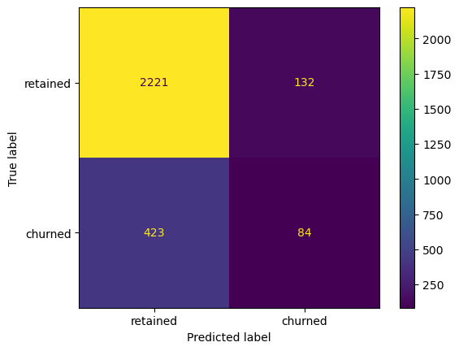

# Waze User Churn Analysis and Prediction

## Executive Summary

This project analyzes monthly user churn for the Waze navigation app and evaluates how effectively behavioral data can identify users at risk of leaving the platform.

The work demonstrates an end-to-end analytics workflow, from data validation and exploratory analysis to predictive modeling and business recommendations.

Outcome  
Machine learning models improved churn detection compared to a statistical baseline, but results indicate that more granular data is required for reliable churn prediction.

---

## Business Context

Waze relies on active users to maintain accurate, real-time navigation data. When users churn, both engagement and network value decline.

This project focuses on monthly churn, defined as users who stopped using or uninstalled the app within a given month. The goal is to understand behavioral drivers of churn and assess whether predictive models can support retention strategies.

---

## What This Project Demonstrates

- Framing a business problem as a measurable analytics question
- Cleaning and validating real-world user data
- Translating exploratory analysis into modeling decisions
- Applying statistical hypothesis testing correctly
- Engineering features to improve model signal
- Selecting evaluation metrics based on business risk
- Communicating results clearly to non-technical stakeholders

---

## Data Overview

Each row represents one user from a single month of activity.

Key variables include:
- sessions
- drives
- kilometers driven
- driving duration in minutes
- active days and driving days
- device type
- churn label

### Class Balance and Device Split

| Churn distribution | Device distribution |
|---|---|
|  |  |

Left: retained vs churned users. Right: Android vs iPhone usage split.

---

## Analytical Workflow

1. Inspect and validate the dataset
2. Explore behavioral patterns and outliers
3. Test assumptions with hypothesis testing
4. Build a baseline predictive model
5. Improve performance using tree-based models
6. Translate findings into business recommendations

---

## Exploratory Data Analysis

User behavior varies widely, with strong right-skew and extreme outliers across engagement metrics.

### Session Activity Patterns

| Distribution | Outliers |
|---|---|
|  |  |

Most users cluster near the median, with a long tail of high-usage users.

### Driving Intensity

Driving distance varies substantially, suggesting different usage profiles.

### Feature Relationships

Driving days and activity days are highly correlated, indicating feature redundancy.

---

## Hypothesis Testing

A two-sample t-test evaluated whether average monthly drives differ between iPhone and Android users.

Results
- iPhone mean drives: `67.86`
- Android mean drives: `66.23`
- p-value: `0.143`

The null hypothesis was not rejected. Device type does not meaningfully explain usage differences or churn risk.

---

## Baseline Model: Logistic Regression

A binomial logistic regression model was built as a baseline predictor.

Additional engineered features included:
- kilometers per driving day
- professional driver flag, defined as more than 60 drives per month

Professional drivers churned at a substantially lower rate than non-professional users.

Strong correlations required removal of redundant features before modeling.

Model performance
- Accuracy: `0.82`
- Precision: `0.52`
- Recall: `0.09`
- F1 score: `0.16`

---

## Model Comparison

| Logistic Regression | XGBoost |
|---|---|
|  |  |

XGBoost improves churn detection compared to the baseline, but many churners are still missed.

---

## Advanced Model: XGBoost

XGBoost was selected as the champion model due to improved recall and balanced performance.

Final test performance
- Accuracy: `0.81`
- Precision: `0.39`
- Recall: `0.17`
- F1 score: `0.23`

Most high-impact predictors are engineered features, highlighting the value of feature creation.

---

## Interpretation and Limitations

While tree-based models improved churn detection, performance remains constrained by data granularity. Aggregated behavioral features alone are insufficient for strong churn prediction.

Additional contextual data would likely improve model effectiveness.

---

## Recommendations

- Collect more detailed behavioral and contextual data
- Expand feature engineering efforts
- Investigate high-distance and irregular-use users separately
- Maintain parity between Android and iPhone experiences
- Treat churn modeling as an iterative process

---

## Repository Structure

- `notebooks/` for analysis notebooks in execution order
- `images/` for charts referenced in this README
- `reports/` for executive summaries and supporting material

---

## Final Note

This project was completed as part of the Google Advanced Data Analytics Certificate and reflects applied skills in data analysis, statistics, and machine learning using a real-world business scenario.
